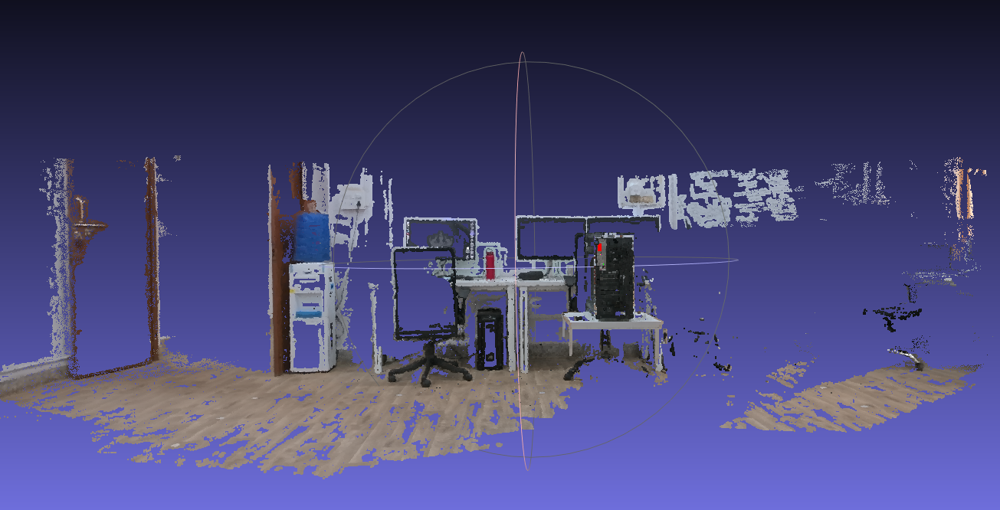
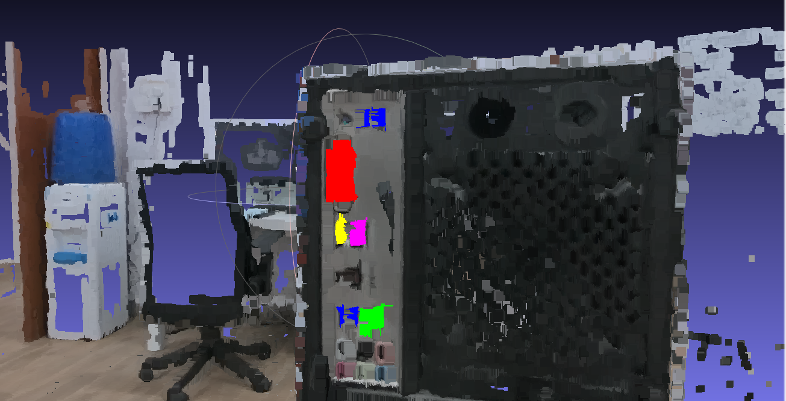
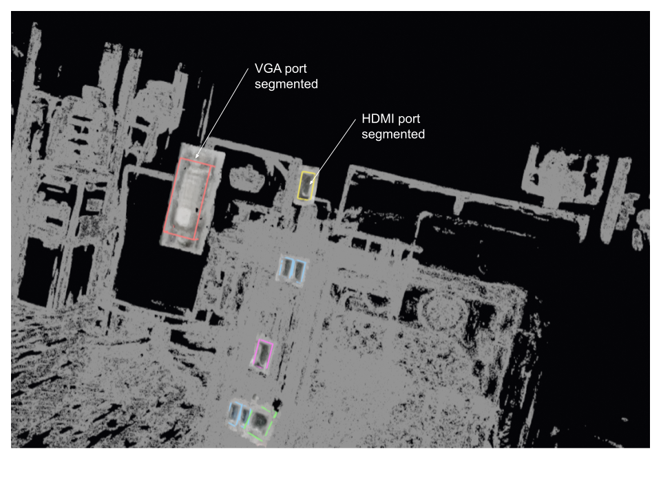

# RP_3D_recon
## DEPENDENCIES
  - pycolmap ( For CUDA support install colmap from source)
  - ultralytics
  - open3d
  - numpy
  
## To run 
Run the file run_reconstruction.py for building the 3d model. The dense model output will be stored in dense_reconstruction (Note: currently it already has the built model which can be used for visualizer application as part of coolness)

```
python3 run_reconstruction.py
```
   
Now change the input image file path in run_yolo.py and run to get the output labels in yolo_output folder

```
python3 run_yolo.py
```

copy the bounding box ouput from yolo_output folder to input_poses folder (Note: currently it has the labels for the 4 ports which is asked during the final submission of the project)
Here for the 3D bounding box, we used the apriori information of ports (all ports within certain range of depth like not more than few cms), this information is used to filter out the corresponding ray projection of 2d box into 3d space.
This controlled by ```min_depth``` for getting the closes point from camera and ```abs_tolerance``` for getting the objects in similar size of ports (apriori information). This should be tuned according to the object.
```
python3 run_bbox_3d.py
```

The segmented model is generated 

Dense Model (May be not so visually appealing, but metrically and geometrically rich)


Bounding boxes detected with yolo models


## To run the application after buiding the model
Now there is a model and corresponding OBB box is uploaded in this repository. To visualize the model and move the segmented part around, you can readily run the repo without running the above.

```
python3 app.py
```

Segmented parts in the application


## OUTPUT
1. Sparse output
2. Dense output and PLY model
3. Segmented 3D model for individual bounding boxes
